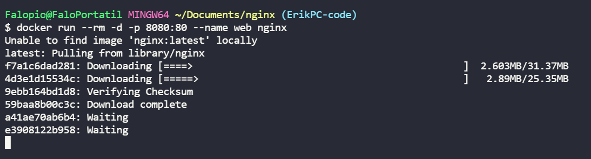
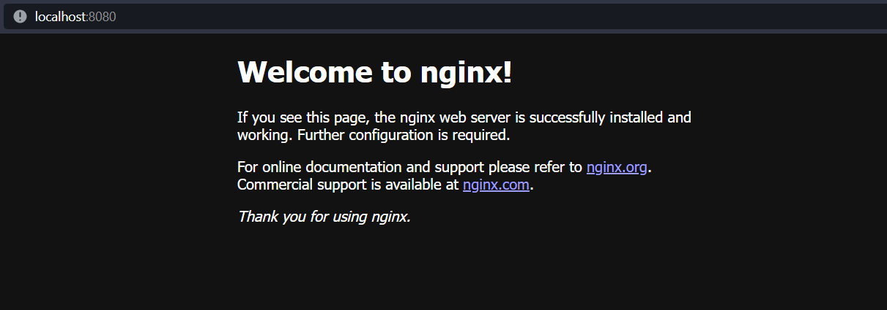
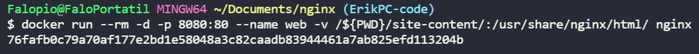
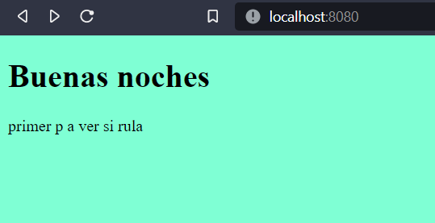
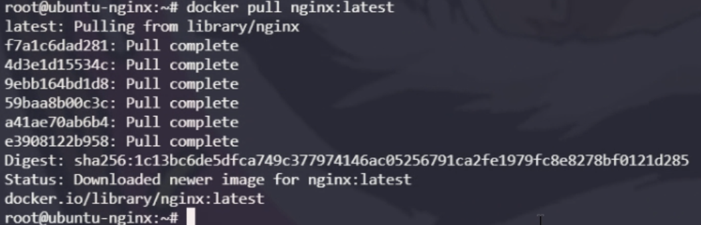
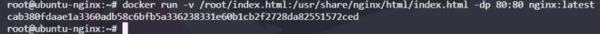
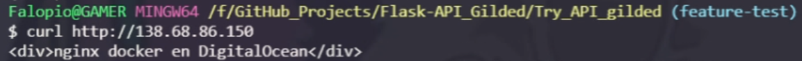

Vamos a crear un docker con un servidor web llamado nginx. A peticion de entrega nos descargaremos la imagen nginx oficial, pero si quereis que sea más ligera cuando use nginx puedes poner nginx:alpine que tambien es oficial.

# Creando una imagen personalizada en docker: Nginx

## Parte A: Siguiendo la guía que explicaremos paso a paso, deberéis replicar tanto el escenario propuesto como su solución.

#### Lanzar docker nginx

Para empezar usaremos el siguiente comando para lanzar el docker de Nginx, en el caso de que no tengamos el docker descargado , no hay problema , se descargara automaticamente.

```bash
$ docker run --rm -d -p 8080:80 --name web nginx
```

El "name" web no es necesario, pero le pongo este nombre para acordarme de el y no tener que sacar el ID del docker to el rato.



Para comprobar que el servidor funciona , vamos al navegador y ponemos "localhost:8080"



Podemos eliminarlo rápidamente usando

```bash
$ docker rm -f web
```

que no es recomendable , asi que usaremos

```bash
$ docker stop web
```

Como cuando lanzamos el comando pusimos --rm se eliminara cuando hagamos un "docker stop". En el caso de no haberlo lanzado con --rm, se haría lo siguiente.

```bash
$ docker stop web
$ docker rm web
```

#### Lanzar docker Nginx con content personalizado

Para lanzarlo con el contenido de un repositorio que nosotros queramos nos dirijimos en la terminal hasta donde tengamos la carpeta con el contenido que vayamos a pasar.Una vez estemos en el path conrrcto lanzamos el siguiente comando

```bash
$ docker run  --rm -d -p 8080:80 --name web -v /${PWD}/site-content/:/usr/share/nginx/html/ nginx
```

Con el ${PWD} es una variable de entorno que al usar PWD es como decir "power directory" que aqui significa el directorio donde estamos.



Con esto hacemos que tire el docker a funcionar copiando desde el directorio que estamos la ruta que especificamos a el directorio que hemos puesto despues de los ":".

Comprobamos que se haya creado bien



## PARTE B ¿Es posible publicar la web de pruebas mediante Microsoft Azure? Describe tu proceso de investigación.

#### Descargar nginx en la vps

Vamos a descargar la imagen de nginx

```bash
$ docker pull nginx:latest
```



Una vez descargado vamos a crear el index personalizado que vamos a meter en nginx

```bash
$ echo "<div>nginx docker en DigitalOcean</div>"
```


Ahora vamos a crear el contenedor con la imagen de nginx junto a los parametros deseados

```bash
$ docker run -v /root/index.html:/usr/share/ngix/html/index.html -dp 80:80 nginx:latest
```



Ahora vamos a comprobar que podemos conectarnos a la pagina. Como no tenemos ningun DNS la conexion seria usando la ip publica del servidor.


